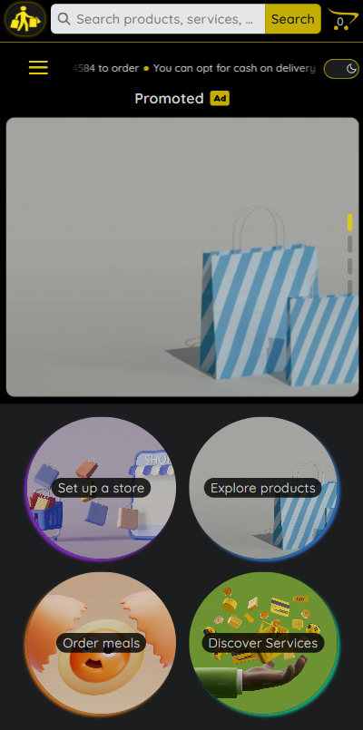

<div align='center'>

# FastmarketX

</div>
<div align='center'>
    <h3>💻 Technologies</h3>
    
    
    
    
    
    
    
    
    
    
    
    
    
    
    
    
    
    <h4><a href="https://fastmarketx.vercel.app/">Live Preview</a></h4>
</div>

<!-- **Demo:** -->

<!--  -->

<details>

**<summary>Screen views</summary>**

**Desktop View:**


<br><br>

<br>

**Tablet View:**


<br>

**Mobile View:**


<br><br>


</details>

## 🌐 Origin

Personal

## 📝 Description

Campus-based e-commerce platform for trading products, meals, and services.

<details>
<summary>Features</summary>

- Theme Change
- Aesthetic

</details>

## 🎯 Relevance

Showcase prowess in NextJS, React, TypeScript and Mongodb

## 👥 Intended Audience

Developers, users, and non-developers.

> [!NOTE]
> Users can install all dependencies using `package.json` file via:
>
> ```bash
> npm install
> ```
>
> To use `manageDeployments.sh`:
>
> ```bash
> sudo apt install gh
> gh auth login
> sudo apt-get install jq
> chmod +x manageDeployments.sh
> ./manageDeployments.sh
> ```

## 📂 Files

<details>
<summary>Invert</summary>

| File                        | Description                                             |
| --------------------------- | ------------------------------------------------------- |
| `/app`                      | The main entry point that bundling begins.              |
| `/app/[account]`            | Displays store of respective accounts.                  |
| `/app/Bot`                  | Provides ChatBot.                                       |
| `/app/cart`                 | All pages related to cart.                              |
| `/app/feedback`             | Feedback form.                                          |
| `/app/Footer`               | Displays footer page.                                   |
| `/app/Header`               | Header of page.                                         |
| `/app/item-detail`          | Renders item detail of each product, service, and meal. |
| `/app/itemTemplate`         | Item displayed at home page.                            |
| `/app/Location`             | Displays location of user on google maps.               |
| `/app/login && /app/signup` | Login and SignUp Page.                                  |
| `/app/Main`                 | Displays item pages.                                    |
| `/app/redux`                | Redux Store.                                            |
| `/app/stores`               | Stores of sellers.                                      |

</details>

## ©️ Credit

<details>
<summary>Invert</summary>

| File | Description |
| ---- | ----------- |

</details>

## 🔄 Improvements

<details>
<summary>Invert</summary>

- [ ] Finish Backend

</details>

## 👤 Curator

1. [Ace Da Costa Silvanus](https://github.com/asdacosta)

**[🞁 Top](#fastmarketx)**
